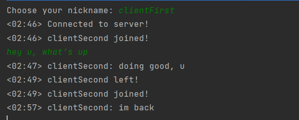
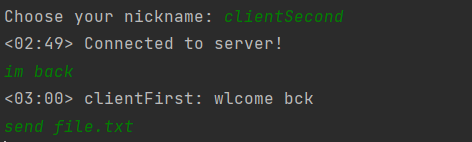
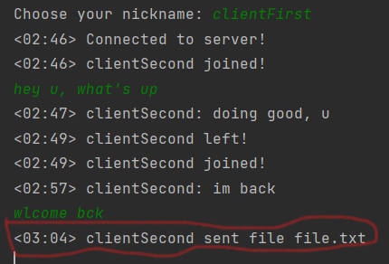

# Lab1 TCP-Chat

## Protocol
We have simple protocol here, witch assumes communication via messages.
The maximum size is set at 1024, if the file size exceed the MaxSize, the client will be disconnected

If the client send message exceeding the MaxSize, the message will be cut according to the maximum size and will be sent
the protocol uses ascii encoding

## Use
to run the server : `py server.py`
to run the client : `py client.py`
to send file : `send {filename}.{type}`

## Demonstration

### *server:*

the server does not display messages sent between users

### *clientFirst:*

all users receive a notification when a user joins/leaves the chat

### *clientSecond:*

### *Sending File:*

before 

when

after

