# Лабораторная 1 - TCP чат

## Инструкция по использованию

### Для запуска необходимо установить python на компьютер

### Сервер:

* Для запуска : py server.py

### Клиент:

* Для запуска : py client.py

* После запуска : ввести имя пользователя

* Команда для отправки файла : send file.txt ( имяФайла.расширение ) 

## Протокол:

* 10 байт на заголовок
* 10-ый байт обозначает отправку файла 
* 9-ый байт обозначает уведомление об отключении/подключении клиента 
* байты до 8 (включительно) обозначают размер передаваемого сообщения
* Обычное сообщение : заголовк с длиной имени, имя , заголовок с длиной сообщения, сообщение
* Файл : заголовок имени ( 10ый байт === 1) , имя, заголовок с длиной заголовка файла, заголовок файла, файл
* Уведомление : заголовок с длиной уведомления ( 9ый байт === 1 ) , уведомление 

## Демонстрация работы:

Сервер выводит сообщения в консоль при любых действиях клиентов

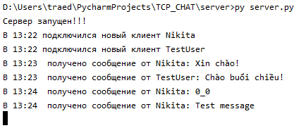 

Что видят пользователи:

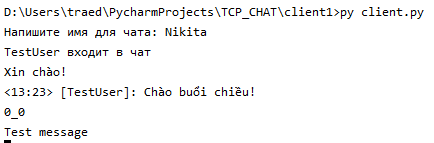 

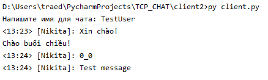 

Если хочет подключиться пользователь, с именем, другого пользователя на сервере:

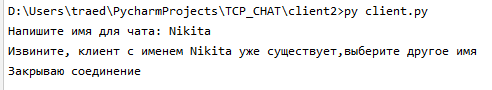 

Сервер не даст подключиться такому клиенту и отключит его.

Теперь передадим файл. Для демонстрации передачи файла, клиент был запущен в двух разных папках : client1 и client2, сервер также вынесен в отдельную папку.

Структура :

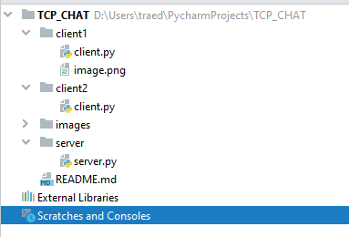 

Попробуем передать файл image.png . Для этого введём команду "send image.png" от имени пользователя запущенного из папки client1.

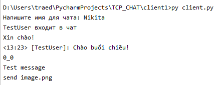 

Что увидят другие пользователи:

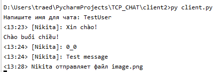 

Что покажет сервер:

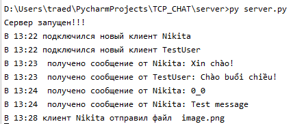 

После отправки файла структура проекта будет выглядеть так:

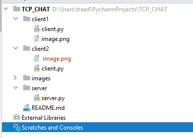 

Файл появился в папке client2, в папке сервера ничего не появилось.

Теперь отключим одного пользователя:

Что увидят другие пользователи:

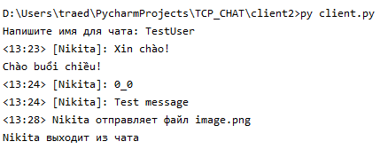

Что напишет сервер:

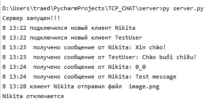

