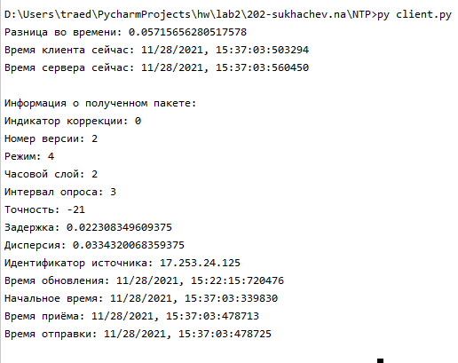

# NTP

### Описание реализации:

Клиент отправляет пакет на сервер pool.ntp.org на порт 123

Результатом работы клиента будет вычисление на сколько времени отстают часы клиента по сравнению с временем сервера

FORMAT = "!B B b b 11I" === unsigned char unsigned char signed char signed char 11 * unsigned int

unsigned char === 1 byte

signed char === 1 byte

unsigned int === 4 byte

Такой формат нужен чтобы легче обработать данные, по формату пакета видно, что только первое 32х битное слово 
содержит много других полей, поэтому первое 32х битное слово удобнее считать по байтам

Формат пакета:
```
       0                   1                   2                   3
       0 1 2 3 4 5 6 7 8 9 0 1 2 3 4 5 6 7 8 9 0 1 2 3 4 5 6 7 8 9 0 1
      +-+-+-+-+-+-+-+-+-+-+-+-+-+-+-+-+-+-+-+-+-+-+-+-+-+-+-+-+-+-+-+-+
      |LI | VN  |Mode |    Stratum     |     Poll      |  Precision   |
      +-+-+-+-+-+-+-+-+-+-+-+-+-+-+-+-+-+-+-+-+-+-+-+-+-+-+-+-+-+-+-+-+
      |                         Root Delay                            |
      +-+-+-+-+-+-+-+-+-+-+-+-+-+-+-+-+-+-+-+-+-+-+-+-+-+-+-+-+-+-+-+-+
      |                         Root Dispersion                       |
      +-+-+-+-+-+-+-+-+-+-+-+-+-+-+-+-+-+-+-+-+-+-+-+-+-+-+-+-+-+-+-+-+
      |                          Reference ID                         |
      +-+-+-+-+-+-+-+-+-+-+-+-+-+-+-+-+-+-+-+-+-+-+-+-+-+-+-+-+-+-+-+-+
      |                                                               |
      +                     Reference Timestamp (64)                  +
      |                                                               |
      +-+-+-+-+-+-+-+-+-+-+-+-+-+-+-+-+-+-+-+-+-+-+-+-+-+-+-+-+-+-+-+-+
      |                                                               |
      +                      Origin Timestamp (64)                    +
      |                                                               |
      +-+-+-+-+-+-+-+-+-+-+-+-+-+-+-+-+-+-+-+-+-+-+-+-+-+-+-+-+-+-+-+-+
      |                                                               |
      +                      Receive Timestamp (64)                   +
      |                                                               |
      +-+-+-+-+-+-+-+-+-+-+-+-+-+-+-+-+-+-+-+-+-+-+-+-+-+-+-+-+-+-+-+-+
      |                                                               |
      +                      Transmit Timestamp (64)                  +
      |                                                               |
      +-+-+-+-+-+-+-+-+-+-+-+-+-+-+-+-+-+-+-+-+-+-+-+-+-+-+-+-+-+-+-+-+
```

### Описание работы:

Клиент формирует пакет устанавливая только поля VN = 2, mode = 3 (клиент) и
поле Transmit Timestamp равным количеству секунд с 1 января 1900 года

Далее клиент пытается отправить пакет на сервер, количество попыток равно 10,
для каждой попытки формируется новый пакет

По получению ответа от сервера, клиент вычисляет разницу во времени по следующей формуле:
* Вычисляет время прибытия пакета 
* Вычисляется время пути пакета по формуле : 

arriveTime - время получения пакета клиентом

originate - время отправки запроса

transmit - время отправки ответа

receive - время получения запроса

travelTime = ((arriveTime - originate) - (transmit - receive)) / 2

* Вычисляется разница во времени:

receive - originate - travelTime

Пример работы:




