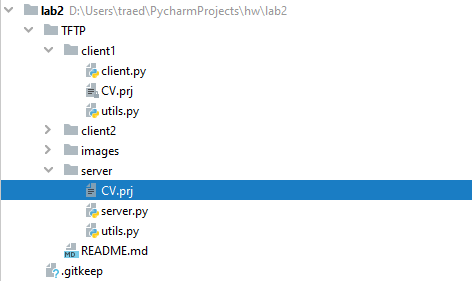

# TFTP 

Описание реализации:

На 69 порту сокет для принятия запросов чтения/записи, на порту 5000 для отправления пакетов подверждения и данных

Описание протокола:

Всего 5 типов пакетов:
```
opcode  operation
            1     Read request (RRQ) 
            2     Write request (WRQ)
            3     Data (DATA)
            4     Acknowledgment (ACK)
            5     Error (ERROR)
```   

Формат пакета с запросом

```
            2 bytes     string    1 byte     string   1 byte
            ------------------------------------------------
           | Opcode |  Filename  |   0  |    Mode    |   0  |
            ------------------------------------------------

                               RRQ/WRQ packet
```

Формат пакета с данными

```
                   2 bytes     2 bytes      n bytes
                   ----------------------------------
                  | Opcode |   Block #  |   Data     |
                   ----------------------------------

                               DATA packet
```
Формат пакета подтверждения:

```
                          2 bytes     2 bytes
                         ---------------------
                        | Opcode |   Block #  |
                         ---------------------

                               ACK packet
```

Формат пакета с ошибкой:

```
                2 bytes     2 bytes      string    1 byte
               -----------------------------------------
              | Opcode |  ErrorCode |   ErrMsg   |   0  |
               -----------------------------------------

                               ERROR packet
```

### Тестирование

Сервер протестирован с TFTP клиентом в windows:

Папка проекта изначально


Попробуем отправить файл CV.prj на сервер.


Результат: Файл успешно загружен на сервер



Теперь удалим файл CV.prj из папки клиента, и скачаем его с сервера

Папка проекта до:


Выполнение команды:


Результат: Файл успешно скачан с сервера


